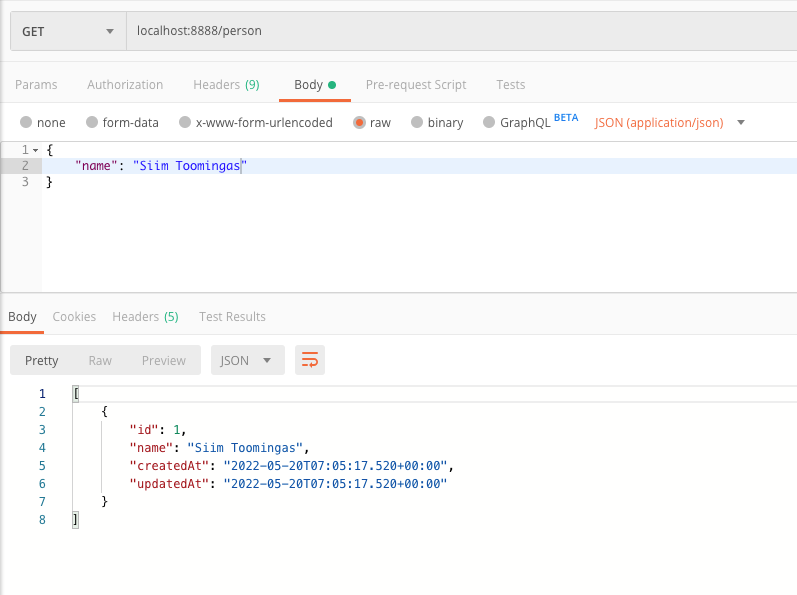

# person application

* Clone to computer 
  $git clone https://github.com/c981890/person.git 
     
* Compile  
  change directory to person  
  $mvn compile
    
* Make the package  
  $mvn package
    
* Run the application  
  After previous step a new jar file is created into the target folder  
  $java -jar target/person-0.0.1-SNAPSHOT.jar
    
* After using close the application with Ctrl+c
    

Access to H2 database console from web browser localhost:8888/h2-console  
You can use cURL or Postman to try the application. 
For adding users to database  

For request to see all added persons  

For searching  

  